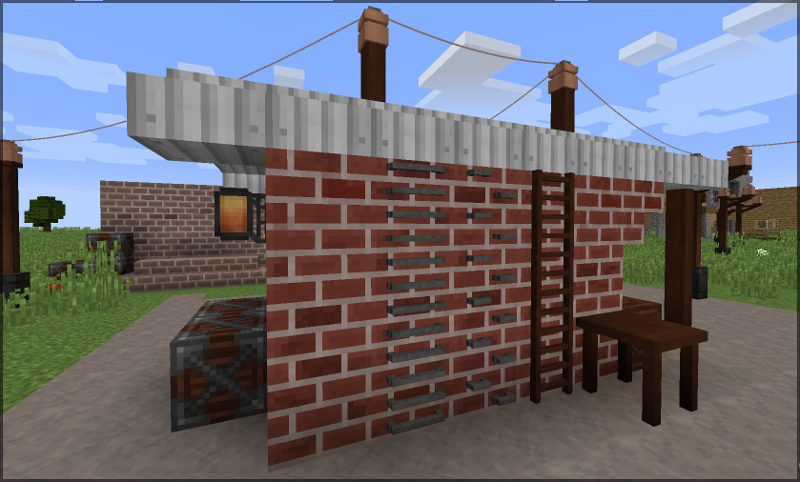
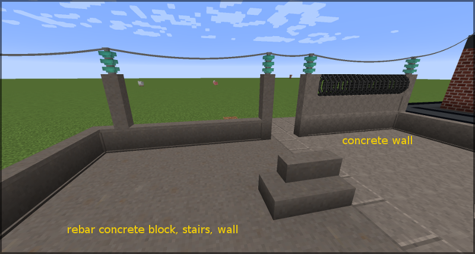
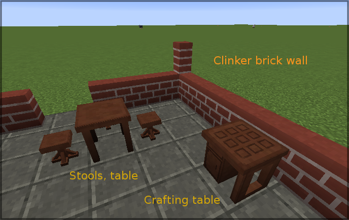
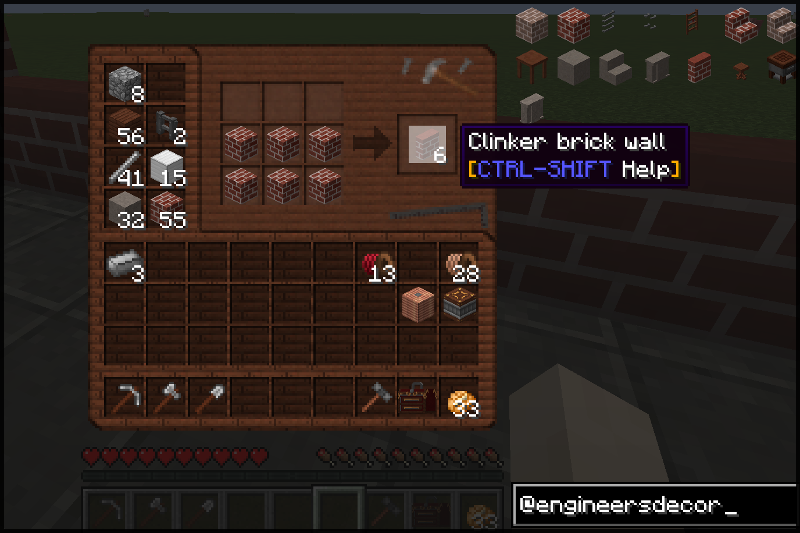

## Engineer's Decor

A [Minecraft](https://minecraft.net) (Java Edition) mod based on
[`Forge`](http://www.minecraftforge.net/), adding cosmetic blocks
for the Engineer's factory, workshop, and home.

### Distribution file download

Main distribution channel for this mod is CurseForge:

  - Release/beta versions: https://www.curseforge.com/minecraft/mc-mods/engineers-decor/files
  - All versions: https://minecraft.curseforge.com/projects/engineers-decor/files

----
### Details

The mod has its focus on non-functional, decorative blocks. If anyhow possible,
no tile entities or user interactions are used. Current feature set:

- Rebar (steel) reinforced concrete: Expensive but creeper-proof. Crafted 3x3 from
  four concrete blocks and five steel rods. Texture design oriented at the IE concrete,
  slightly darker, eight (position dependent) random texture variations with rust
  traces. Also creaftable in form of *stairs* and *walls*.

- Concrete wall: Solid concrete wall (not the vanilla wall design), crafted 3x3
  from six IE concrete blocks (normal wall recipe).

- *Clinker bricks*: Slightly darker and more colorful version of the vanilla brick
  block. Eight position dependent texture variations are implemented to make the
  wall look more "alive". Crafted 3x3 with a brick block in the centre and any
  combination of bricks and nether bricks around (actually, anything where the
  ore dictionary says it's a "brick ingot"). Higher explosion resistance than the
  vanilla brick wall. Also available as stairs and wall, crafted as usual. There
  is a reverse recipe to get three clinker brick blocks back from four stairs.

- *Slag bricks*: Gray-brownish brick, also eight texture variations. Crafted 3x3
  from slag in the centre and any kind of bricks ("brick ingot") around. Has a higher
  explosion resistance than the vanilla brick wall. Also available as stairs, also
  with reverse recipe.

- *Treated wood crafting table*: 3x3 crafting table with IE style GUI and a model
  fitting better in the engineer's  workshop. Crafted 2x2 with two treated wood
  slabs, one crate, and one treated wood plank.

- *Treated wood ladder*: Crafted 3x3 with the known ladder pattern, items are
  treated wood sticks.

- *Metal rung ladder*: Industrial wall-fixed ladder with horizontal bent rods.
  Crafted 3x3 with five iron or steel rods in a "U" pattern.

- *Staggered metal steps*: Industrial wall-fixed sparse ladder with steps in a
  zip pattern. Crafted 3x3 with six iron or steel rods in a zip pattern.

- *Treated wood table*: Four leg table made out of treated wood. Crafted 3x3
  with three treated wood slabs and four treated wood poles. Guess the pattern.

- *Treated wood stool*: Simple small stool fitting to the table. Crafted 3x3
  with three treated wood slabs and one treated wood pole.

- *Treated wood pole*: Pole fragment that can be placed in all directions. It
  does intentionally not connect to posts, fences, etc - just a straigt pole.
  Can be used e.g. for structural support or wire relay post, where the height
  of the IE wire posts does not match.

More to come slowly but steadily.

----
### Mod pack integration, forking, back ports, bug reports, testing

  - Packs: If your mod pack ***is open source as well and has no installer***,
    you don't need to ask and simply integrate this mod.

  - Bug reports: Yes, please let me know. Drop a mail or better open an issue
    for the repository.

  - Pull requests: Happily accepted. Please make sure that use the ***develop
    branch*** for pull requests. The master branch is for release versions only.
    I might merge the pull request locally if I'm ahead of the github repository,
    we will communicate this in the pull request thread then.

  - The mod config has an "include testing features" option. Enabling this causes
    blocks under development to be registered as well.

----
## Revision history

Mod versions are tracked in the readme files for individual Minecraft versions, and
of course in the commits of this repository. Beta and release versions that are
distributed as compiled `jar`s are tagged accordingly. Release versions are merged
into the `master` branch, while beta/alpha version tags link to `develop` branch
commits.

  - [1.12](1.12/readme.md)

  - [1.13](1.13/readme.md)

### Community references

Mods covering similar features, or may fit well together with IE and the decorations of this mod:

- [Immersive Engineering](https://github.com/BluSunrize/ImmersiveEngineering/): Without IE, my
  little mod here does not make much sense ;). It works without IE, but quite a few blocks are
  not craftable.

- [Engineer's doors](https://www.curseforge.com/minecraft/mc-mods/engineers-doors) has brilliant
  doors, trapdoors, and fence doors, all made of the IE materials.

- [Dirty Bricks](https://www.curseforge.com/minecraft/texture-packs/dirty-bricks-vanilla-add-on) applies
  position dependent variations to the vanilla bricks, similar to the clinkers and slag bricks in this
  mod.

- [Chisel](https://www.curseforge.com/minecraft/mc-mods/chisel) needless to say, Chisel has a variety
  of factory blocks.

### Screenshots

